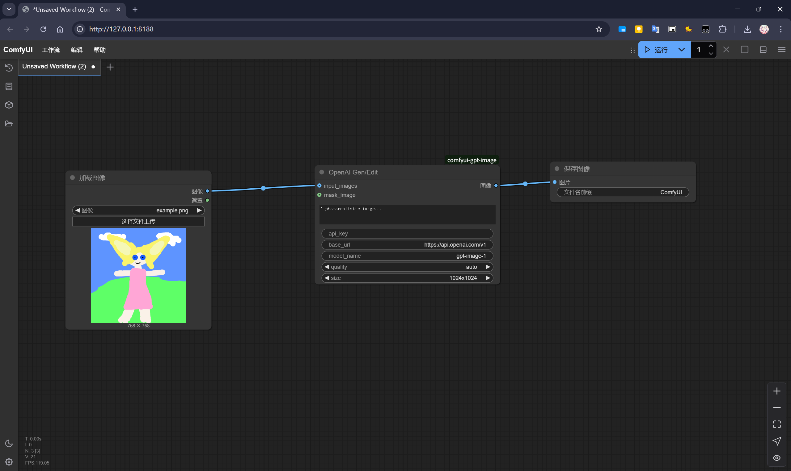

# GPT Image Node For Comfyui

Since Comfyui make the GPT image node as a paid feature, this repo can help you use the GPT image from OpenAI's official api.

## Installation

1. cd and clone the repo to Comfyui's `custom_nodes` folder.

   ```bash
   cd /your/path/to/Comfyui/custom_nodes
   git clone https://github.com/t4wefan/comfyui-gpt-image
   ```

2. launch Comfyui as usual.

   `openai` library will be installed, if not, you can install it by yourself.

## How to Use

Load `example.json` in the repo in Comfyui, fill in the key and base url and generate.

